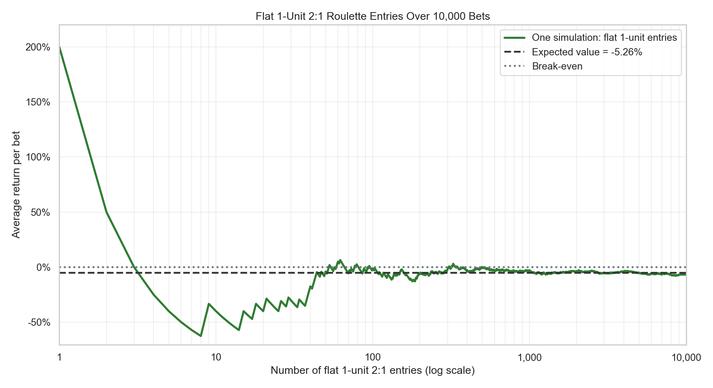
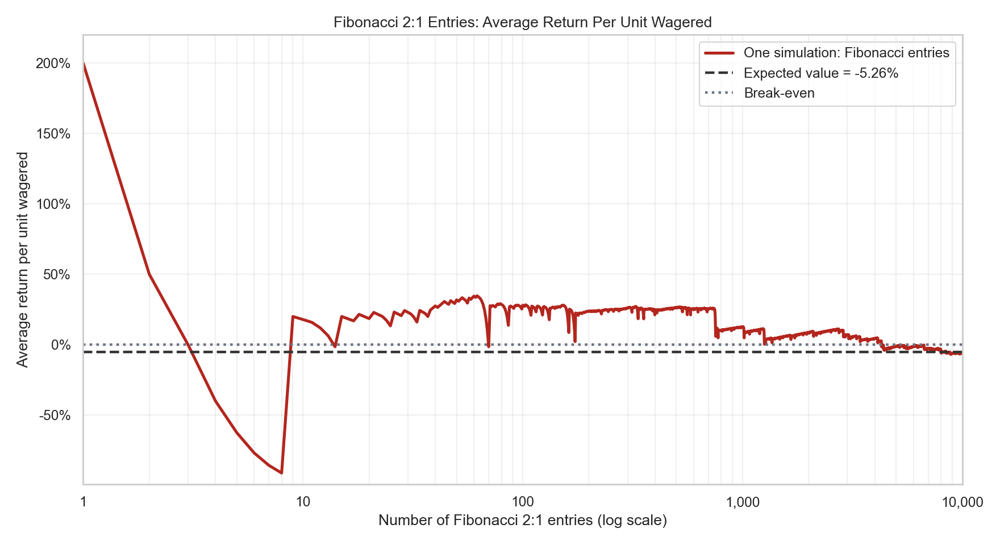
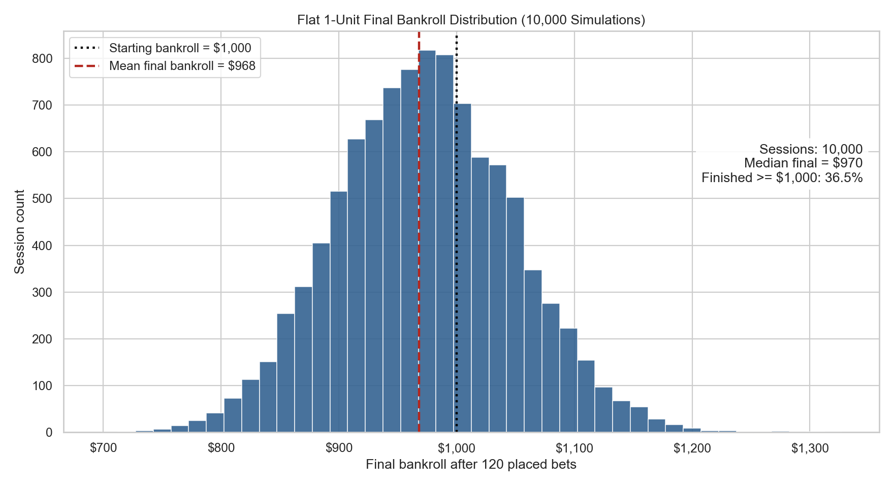
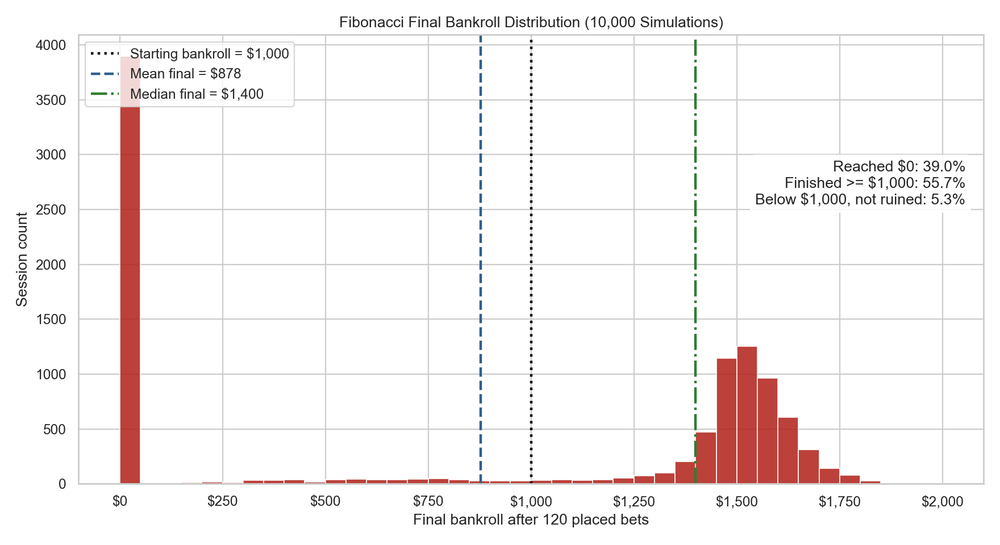
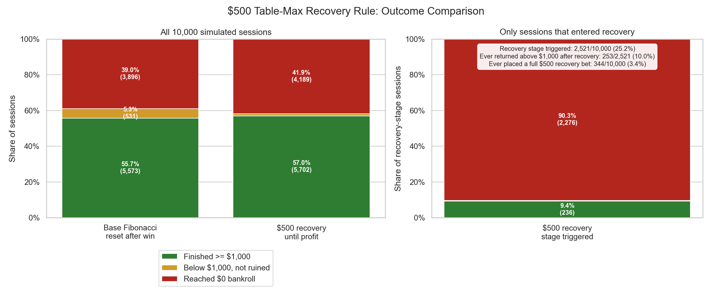
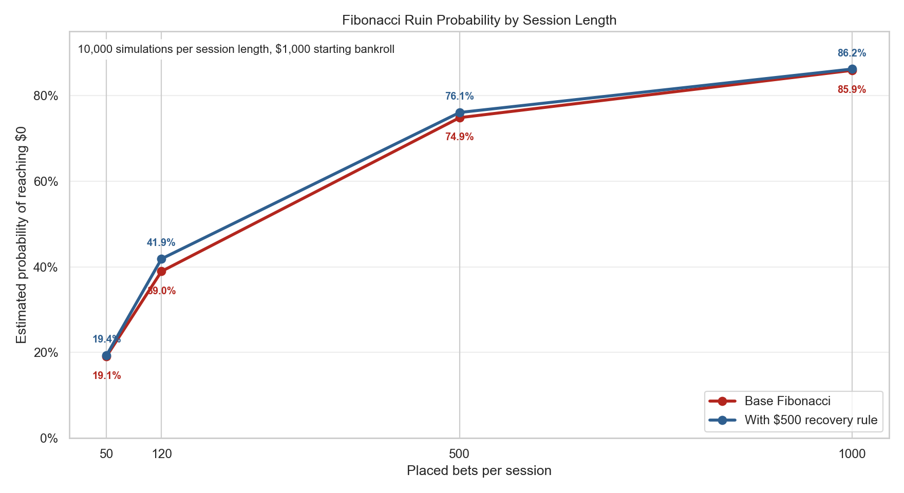

# Monte Carlo vs “Unbeatable” Roulette Strategy

## Project Aim
This project uses expected value and Monte Carlo simulation to disprove a roulette betting strategy that claims to achieve a 98% win rate. The goal of this project is to test the strategy quantitatively and clarify common misunderstandings of gambling. By the end of this report readers should be able to understand why most gambling strategies do not overcome the house edge of casinos.

For simplicity, **American roulette** will be used for this report, which has 38 pockets: numbers 1–36, 0, and 00.

<table>
  <tr>
    <td>
      
    </td>
    <td>
      
    </td>
  </tr>
</table>

## The Strategy in Question
The “Fibonacci Golden Entry Strategy” appears to work as follows:

The strategy assumes a roulette table with a $5 minimum bet and a $500 maximum bet; 1 betting unit is treated as $5.

The player bets on either columns or dozens, both of which pay 2:1.

<table>
  <tr>
    <td>
      
    </td>
    <td>
      
    </td>
  </tr>
</table>

The player starts by betting 1 unit. After each loss, the next bet increases according to the Fibonacci sequence. After a win, the player resets to the original 1-unit bet.

The Fibonacci betting sequence is:

$$
1,\ 1,\ 2,\ 3,\ 5,\ 8,\ 13,\ 21,\ 34,\ 55,\ 89
$$

In dollar terms, this becomes:

$$
5,\ 5,\ 10,\ 15,\ 25,\ 40,\ 65,\ 105,\ 170,\ 275,\ 445
$$

With a $500 table maximum, the largest Fibonacci bet that can be placed within the table limit is 89 units, or $445. The next Fibonacci value would be 144 units, equal to $720, which exceeds the table maximum. Once the progression reaches this point, the strategy recommends using the table maximum in an attempt to recover losses and return to session profit.

The strategy also requires the player to move their next bet to the column or dozen that won most recently. This is presented as the “golden entry” rule.

If the player loses four bets in a row, it is advised to stop betting temporarily until the column or dozen they last lost on wins again, then resume betting and continue the sequence.

## Why the Strategy Has Negative Expected Value
The strategy is built on several flawed assumptions and statistical misconceptions. These include the belief that choosing columns instead of dozens provides a mathematical advantage, misunderstanding the relationship between win rate and expected value, and assuming that past roulette spins can influence future outcomes. This report uses expected value only as a mathematical baseline; the main focus is using simulation to test the claimed 98% win rate.

### Expected Value Baseline

For a 1-unit column or dozen bet in American roulette, the player wins on 12 of the 38 pockets and loses on the other 26. Since the bet pays 2:1, the expected value is:

$$
EV = \left(\frac{12}{38} \times 2\right) - \left(\frac{26}{38} \times 1\right)
$$

$$
EV = \frac{24}{38} - \frac{26}{38}
$$

$$
EV = -\frac{2}{38}
$$

$$
EV \approx -0.0526
$$

This means the bet has an expected loss of about 5.26% per unit wagered. The simulations below show what that negative edge looks like across one bankroll path and then across thousands of possible sessions.

## Average Return Over Time

### Flat 1-Unit Betting

To further examine this, we can look at the average return over time for the underlying 2:1 column or dozen bet. An expected value of -5.26% does not mean every short session will lose exactly 5.26%. Early outcomes can dominate the average return because only a small number of bets have happened.

The chart below uses a single simulated sequence of 10,000 flat 1-unit entries on a 2:1 column or dozen bet, where the first bet is forced to win. The x-axis uses a log scale so the first few bets and the long-run trend can be more visible.

In the early stages, the average return is more volatile. As more bets are placed, the effect of the first win becomes smaller and the average return moves toward the negative expected value of -5.26%. This is why a strategy can feel powerful after an early win while still being mathematically unfavorable over time.

### Fibonacci Betting

Using the Fibonacci system, the bet size changes after losses. This creates a different average-return pattern compared with flat 1-unit betting because later bets can be much larger than earlier bets.

Because the stake size changes, the fairest way to measure average return is:

$$
\text{Average return} = \frac{\text{cumulative profit}}{\text{cumulative amount wagered}}
$$

This measures how much profit or loss is being made for every unit wagered, rather than simply averaging by the number of bets.

From the chart, the average return is still volatile at the beginning. It can also appear stronger for long periods because wins after larger Fibonacci bets can quickly lift the average. However, the Fibonacci system does not change the probability of winning the next spin. Each column or dozen bet still has the same expected value of -5.26%.

The chart is more jagged because losses later in the sequence are attached to larger bets. Although the return may hover above break-even for part of the simulation, it still moves back toward the same negative expected value over time. The staking system changes the shape of the risk, not the long-term profitability of the underlying bet.

## One $1,000 Bankroll Simulation

### How the Simulation Works

Average return explains the long-term direction of the bet, but it does not show how a real bankroll can move during one session. Since the strategy recommends starting with a $1,000 bankroll, the next step is to simulate one possible session.

Using Python, I simulated 120 placed bets based on the win probability of a column or dozen bet:

$$
P(\text{win}) = \frac{12}{38}
$$

This simulation uses a fixed random seed, which means the same sequence of random outcomes can be reproduced each time the code is run.

The simulation treats each step as a placed betting entry. Waiting spins where no bet is placed are not counted because they do not change the bankroll. The “golden entry” and waiting rules do not change the probability of the next placed column or dozen bet, which remains 12/38.

### Flat vs Fibonacci Bankroll Path

In this single simulation, there are 37 wins and 83 losses across 120 placed bets. The flat 1-unit strategy ends at $955, a loss of $45. The Fibonacci strategy first rises as high as $1,425, but later reaches $0 on betting entry 112. Maximum run-up measures the highest gain above the $1,000 starting bankroll, while maximum drawdown measures the largest fall from a previous bankroll peak.

| Strategy | Final bankroll | Session result | Peak bankroll | Maximum run-up | Maximum drawdown |
| --- | ---: | ---: | ---: | ---: | ---: |
| Flat 1-unit betting | $955 | -$45 | $1,050 | $50 | $100 |
| Fibonacci betting | $0 | -$1,000 | $1,425 | $425 | $1,425 |

This single path shows why the Fibonacci strategy can look convincing at first. It can produce a smoother-looking profit while the sequence is recovering losses. However, the larger bet sizes also mean that one bad losing streak can erase the bankroll quickly.

### Why One Path Is Not Enough

Although the Fibonacci strategy may appear favorable in the short term, this chart only shows one randomly generated simulation path. There are many possible paths the bankroll could take. To understand the full risk, we need to examine the full distribution of possible outcomes across many simulations.

## Monte Carlo Simulation and Distribution of Outcomes

### Monte Carlo Simulation

Monte Carlo simulation is a simulation that repeats the same random experiment many times. In this report, one experiment is one roulette session. After each session, the final bankroll is recorded. Plotting all final bankrolls creates the distribution of outcomes.

Variance describes how much individual results can spread around the average. In roulette, two players can use the same strategy and still experience very different short-term outcomes because the order of wins and losses matters. The previous bankroll chart showed only one possible simulation path. To understand the full picture, we need to repeat the same setup many times and look at both the bankroll paths and the distribution of final outcomes.

### Flat 1-Unit Distribution

The chart below is based on 10,000 simulated flat 1-unit sessions over 120 placed bets, with 1,000 sample paths shown so the graph remains readable. Each session starts with a $1,000 bankroll and uses a fixed $5 bet for every betting entry.

The flat 1-unit paths stay relatively close to the starting bankroll because each bet is small compared with the $1,000 bankroll. In these 120-entry simulations, no flat 1-unit session reaches $0. However, most paths still drift slightly downward because every $5 bet has negative expected value.

The distribution chart records the final bankroll from all 10,000 flat 1-unit sessions.

The results form a bell-shaped distribution. This means most sessions finish near the average result, while fewer sessions finish far above or far below it.

The mean of the simulation aligns closely with the expected value calculation. The -5.26% expected value applies to the amount wagered, not to the entire $1,000 bankroll. Since 1 unit is $5, the expected loss per bet is:

$$
5 \times 0.0526 \approx 0.26
$$

Over 120 bets, the expected loss is approximately:

$$
120 \times 0.26 \approx 31.58
$$

So the expected final bankroll is:

$$
1000 - 31.58 \approx 968
$$

The histogram also shows that the result of any single session can vary. Although the average final bankroll is about $968, many individual sessions finish higher or lower depending on the order of wins and losses.

### Fibonacci Distribution

The Fibonacci system changes this distribution because the bet size increases after losses. First, the simulation tests the base Fibonacci progression with table-limit capped bets, resetting after any win. The separate $500 recovery rule, where the player keeps betting the table maximum until returning to profit, is tested afterward. To see the base Fibonacci effect, the simulation was repeated 10,000 times using the same setup: a $1,000 starting bankroll, $5 units, 120 placed bets, and Fibonacci bet sizing after losses.

The chart below shows 1,000 sample paths from those 10,000 base Fibonacci sessions. The green paths finish at or above the starting bankroll, while the red paths finish below it. Compared with flat betting, the Fibonacci paths spread much more widely because the bet size grows after losses.

The path chart shows the tradeoff visually: many sessions climb above $1,000, but many others fall sharply to $0. The distribution chart below summarizes the final bankroll from all 10,000 Fibonacci sessions.

The Fibonacci distribution shows why one bankroll path is not enough. Many sessions finish above the starting bankroll, but a large group of sessions also reaches $0. In this simulation, the median final bankroll is $1,400, while the mean final bankroll is only about $878. This happens because the losing sessions are severe enough to pull the average below the starting bankroll.

| Outcome after 120 placed bets | Sessions | Estimated probability |
| --- | ---: | ---: |
| Finished at or above $1,000 | 5,573 / 10,000 | 55.7% |
| Finished below $1,000 but not ruined | 531 / 10,000 | 5.3% |
| Reached $0 bankroll | 3,896 / 10,000 | 39.0% |

The strategy also includes a table-maximum recovery rule. Here, $500 is not a maximum drawdown; it is the largest bet the table allows. Once the Fibonacci progression calls for a bet larger than the $500 table maximum, the player keeps betting up to $500 until the bankroll returns above the original $1,000 starting point or reaches $0.

The chart isolates the effect of that extra rule. The $500 recovery rule slightly increases the share of sessions that finish at or above $1,000, from 55.7% to 57.0%. However, it also increases the ruin rate, from 39.0% to 41.9%. Among the 2,521 sessions that entered recovery mode, 2,276 finished at $0. Only 236 recovery-stage sessions finished at or above the starting bankroll.

This is the key variance problem with the strategy. Fibonacci betting can create many short-term winning sessions, but the losing sessions are much larger. Sessions that reach the table maximum are already in severe loss territory, and continuing with maximum bets creates large swings without removing the negative expected value. The strategy changes the distribution of outcomes, not the long-term profitability of the underlying roulette bet.

### Ruin Probability by Session Length

The 120-entry simulation is useful as a realistic short-session example, but it does not represent what happens if the player keeps using the strategy for longer. As the number of placed bets increases, the player has more chances to hit a losing sequence large enough to wipe out the bankroll.

To test this, I repeated the Fibonacci simulation 10,000 times at different numbers of placed bets per session. The 1,000-entry case is not the true long run, but it acts as a longer-session stress test. The chart compares the base Fibonacci rule with the version that keeps betting up to the $500 table maximum until the bankroll returns to profit.

| Placed bets per session | Base Fibonacci reached $0 | With $500 recovery rule reached $0 |
| ---: | ---: | ---: |
| 50 | 1,912 / 10,000 (19.1%) | 1,935 / 10,000 (19.4%) |
| 120 | 3,896 / 10,000 (39.0%) | 4,189 / 10,000 (41.9%) |
| 500 | 7,488 / 10,000 (74.9%) | 7,609 / 10,000 (76.1%) |
| 1,000 | 8,593 / 10,000 (85.9%) | 8,624 / 10,000 (86.2%) |

The ruin probability increases as the session gets longer. The $500 recovery rule does not reverse this pattern; it slightly increases ruin probability in these simulations. This does not create a new house edge; the house edge was already shown by the -5.26% expected value. The simulation shows how that negative expectation and the Fibonacci bet sizing can translate into bankroll risk over time.

## Conclusion
The simulation results show why the claimed 98% win rate is misleading. The Fibonacci strategy can create many sessions that finish above the starting bankroll, which makes the system look successful in the short term. However, the losing sessions are much larger and often end at $0.

Monte Carlo simulation gives a clearer picture than one selected bankroll path. Over 10,000 simulated 120-entry sessions, the Fibonacci strategy produced many winning sessions, but 39.0% of sessions still reached $0. Adding the $500 recovery rule increased the ruin rate to 41.9%. Longer sessions made the problem worse, with ruin probability rising to 85.9% by 1,000 placed bets for the base Fibonacci strategy.

The strategy does not remove risk; it shifts risk into fewer but much larger losses. That is why a high short-term win rate does not prove the strategy is profitable or safe.
