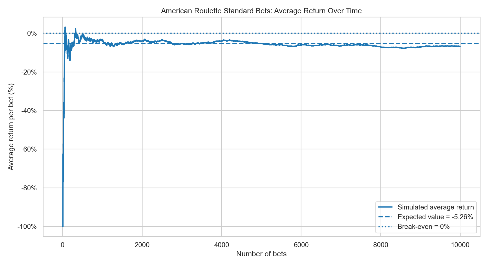
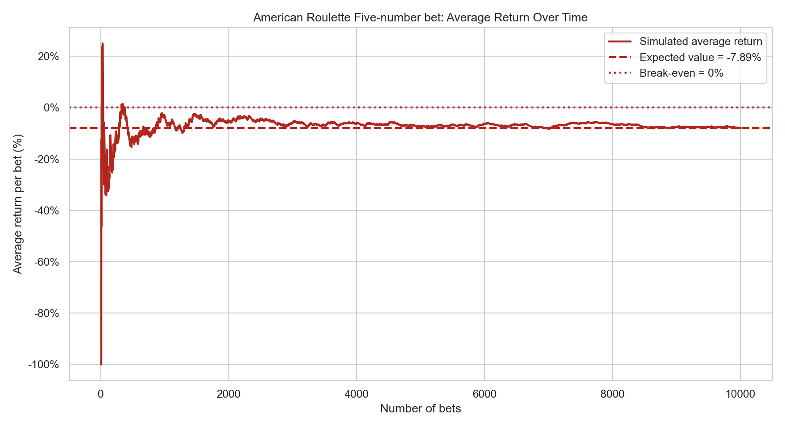
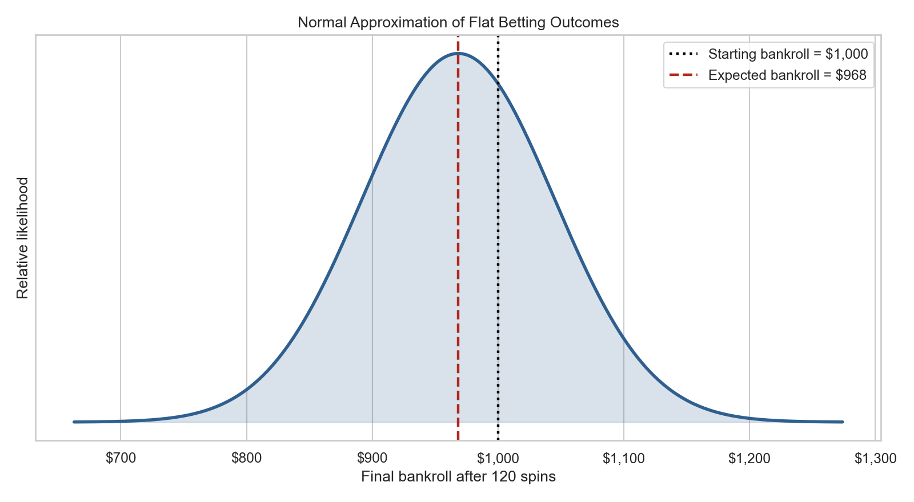
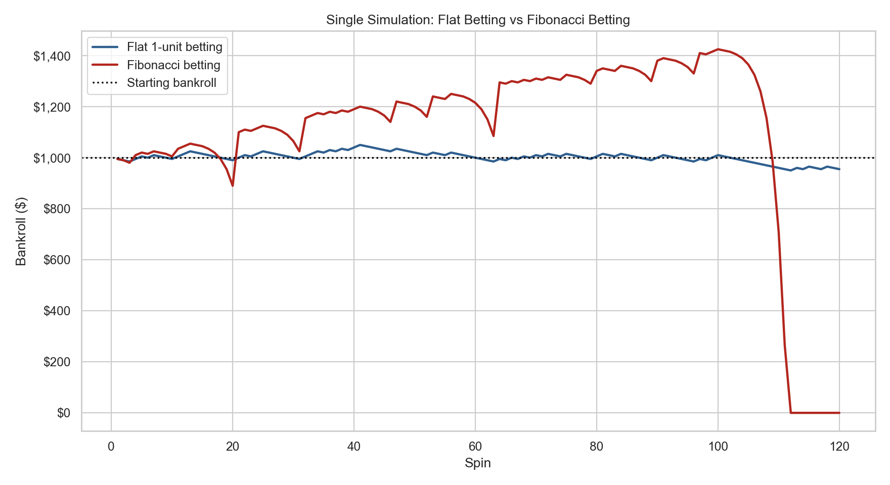
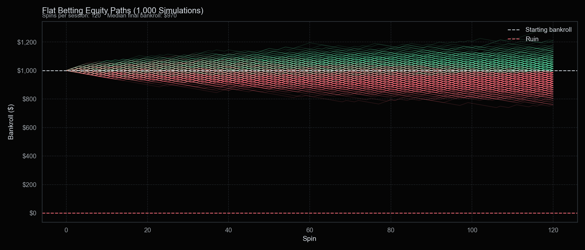
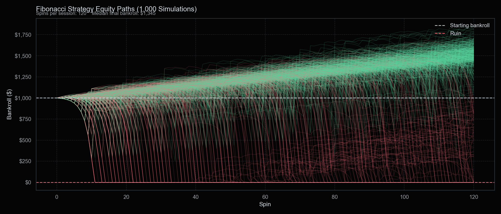
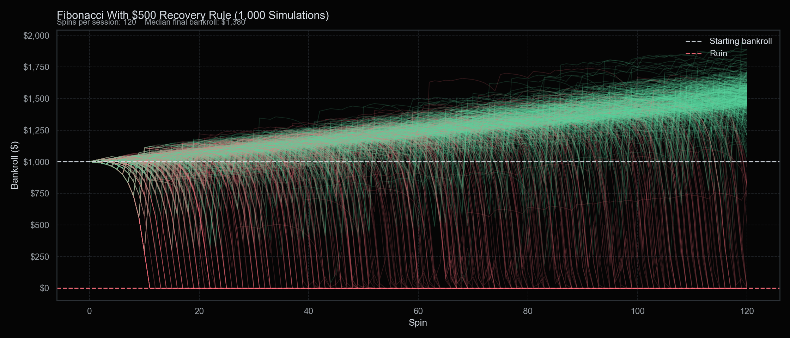

# Monte Carlo vs “Unbeatable” Roulette Strategy


## Project Aim
This project uses probability, expected value, and Monte Carlo simulation to evaluate a roulette betting strategy that claims to achieve a 98% win rate. The strategy was presented in a video with more than 440,000 views and appears to suggest that roulette can be beaten through a Fibonacci-style betting system.

The goal of this project is to test that claim quantitatively. By using mathematical analysis, simulations, and visual evidence, this report shows why the strategy does not overcome the house edge and how it relies on common misunderstandings such as the gambler’s fallacy.

This report uses **American roulette**, which has 38 pockets: numbers 1–36, 0, and 00. This gives most standard bets a house edge of approximately 5.26%.

## The Strategy in Question
The video presenter refers to the strategy as the “Fibonacci Golden Entry.” Based on the video and its comments, the strategy appears to work as follows.

The player bets on either columns or dozens, both of which pay 2:1. The presenter suggests using columns because they appear to contain a wider spread of high and low numbers than dozens. This report later tests whether that claim has any mathematical value.

The strategy assumes a roulette table with a $5 minimum bet and a $500 maximum bet. In this report, 1 betting unit is treated as $5.

The player starts by betting 1 unit. After each loss, the next bet increases according to the Fibonacci sequence. After a win, the player resets to the original 1-unit bet.

The Fibonacci betting sequence is:

$$
1,\ 1,\ 2,\ 3,\ 5,\ 8,\ 13,\ 21,\ 34,\ 55,\ 89
$$

In dollar terms, this becomes:

$$
5,\ 5,\ 10,\ 15,\ 25,\ 40,\ 65,\ 105,\ 170,\ 275,\ 445\ \text{USD}
$$

With a $500 table maximum, the largest Fibonacci bet that can be placed within the table limit is 89 units, or $445. The next Fibonacci value would be 144 units, equal to $720, which exceeds the table maximum. Once the progression reaches this point, the strategy recommends using the table maximum in an attempt to recover losses and return to session profit.

The strategy also requires the player to move their next bet to the column or dozen that won most recently. This is presented as the “golden entry” rule.

If the player loses four bets in a row, they are advised to stop betting temporarily. They wait until the column or dozen they last lost on appears again, then re-enter the game and continue the sequence.

**Key setup assumptions:**

- Roulette version: American roulette
- Table minimum: $5
- Table maximum: $500
- Unit size: $5
- Main bet type: columns or dozens
- Payout: 2:1
- Progression: Fibonacci after losses, reset after wins

[](https://www.youtube.com/watch?v=EMCXZFClPVU)

## Gambler’s Fallacy
### 1. The false advantage of choosing columns over dozens
The strategy suggests choosing columns instead of dozens because columns appear to contain a wider mixture of high and low numbers. However, this reasoning is mathematically misleading.

<table>
  <tr>
    <td>
      
    </td>
    <td>
      
    </td>
  </tr>
</table>

In American roulette, there are 38 pockets in total: numbers 1–36, 0, and 00. Each column contains 12 numbers, and each dozen also contains 12 numbers. Although the numbers are arranged differently on the betting table, their visual position does not affect the outcome of the spin.

<table>
  <tr>
    <td>
      
    </td>
    <td>
      
    </td>
  </tr>
</table>

The winning outcome is determined by where the ball lands on the wheel. On a standard American roulette wheel, each pocket has the same probability of being selected. This means the probability of landing on any single number is:

$P(\text{single number}) = \frac{1}{38}$

Since a column or dozen covers 12 different numbers, the probability of winning is found by adding the probabilities of those 12 individual numbers:

$P(\text{column}) = 12 \times \frac{1}{38}$

$P(\text{column}) = \frac{12}{38} \approx 31.58\%$

The same applies to dozens because each dozen also contains 12 numbers:

$P(\text{dozen}) = 12 \times \frac{1}{38}$

$P(\text{dozen}) = \frac{12}{38} \approx 31.58\%$

Choosing columns over dozens does not provide any mathematical advantage. Both bets cover the same number of pockets and have the same probability of winning. The claim that columns are better because they offer a “wider range of number exposure” is based on the visual layout of the betting table, not on probability.

**Key finding:** Columns and dozens both cover 12 of the 38 pockets, so both have the same win probability of approximately 31.58%.

### 2. Playing 2:1 Payouts to Yield an Advantage

The strategy focuses on bets with a 2:1 payout. At first, this may appear attractive because a winning bet returns twice the stake as profit. However, the payout alone does not determine whether a bet is profitable. To evaluate a roulette bet properly, the **expected value** must be calculated.

Expected value measures the average profit or loss a player can expect per bet over the long run. It is calculated by multiplying each possible outcome by its probability.

For a 1-unit column or dozen bet in American roulette:

$$
P(\text{win}) = \frac{12}{38}
$$

$$
P(\text{lose}) = \frac{26}{38}
$$

A winning column or dozen bet earns 2 units of profit, while a losing bet loses 1 unit. The expected value is:

$$
EV = \left(\frac{12}{38} \times 2\right) - \left(\frac{26}{38} \times 1\right)
$$

$$
EV = \frac{24}{38} - \frac{26}{38}
$$

$$
EV = -\frac{2}{38}
$$

$$
EV \approx -0.0526
$$

This means that for every 1 unit bet, the player is expected to lose approximately 0.0526 units in the long run. In percentage terms, this is an expected loss of:

$$
-5.26\%
$$

This negative expected value applies to most standard American roulette bets. Even though different bets have different payouts, the probabilities and payouts are structured so that the casino keeps the same long-term advantage of approximately 5.26%. The five-number bet, which is only available in American roulette, is the main exception. It covers 0, 00, 1, 2, and 3, pays 6:1, and has an expected value of −7.89%.

| Bet type                      | Numbers covered | Win probability | Lose probability | Payout | Expected value calculation  | Expected value |
| ----------------------------- | --------------- | --------------- | ---------------- | ------ | --------------------------- | -------------- |
| Straight up                   | 1               | 1/38 = 2.63%    | 37/38 = 97.37%   | 35:1   | `(1/38 × 35) - (37/38 × 1)` | −5.26%         |
| Split                         | 2               | 2/38 = 5.26%    | 36/38 = 94.74%   | 17:1   | `(2/38 × 17) - (36/38 × 1)` | −5.26%         |
| Street / Trio                 | 3               | 3/38 = 7.89%    | 35/38 = 92.11%   | 11:1   | `(3/38 × 11) - (35/38 × 1)` | −5.26%         |
| Corner                        | 4               | 4/38 = 10.53%   | 34/38 = 89.47%   | 8:1    | `(4/38 × 8) - (34/38 × 1)`  | −5.26%         |
| **Five-number bet**           | **5**           | **5/38 = 13.16%** | **33/38 = 86.84%** | **6:1** | **`(5/38 × 6) - (33/38 × 1)`** | **−7.89%** |
| Six line                      | 6               | 6/38 = 15.79%   | 32/38 = 84.21%   | 5:1    | `(6/38 × 5) - (32/38 × 1)`  | −5.26%         |
| Dozen                         | 12              | 12/38 = 31.58%  | 26/38 = 68.42%   | 2:1    | `(12/38 × 2) - (26/38 × 1)` | −5.26%         |
| Column                        | 12              | 12/38 = 31.58%  | 26/38 = 68.42%   | 2:1    | `(12/38 × 2) - (26/38 × 1)` | −5.26%         |
| Red/Black, Odd/Even, High/Low | 18              | 18/38 = 47.37%  | 20/38 = 52.63%   | 1:1    | `(18/38 × 1) - (20/38 × 1)` | −5.26%         |

From this chart it can be observed that most American roulette bet types have the same expected value, and the only exception shown is the five-number bet. This means that choosing the five-number bet puts the player at a greater disadvantage compared with the other standard bets. However, switching between straight-up bets, splits, streets, corners, six lines, dozens, columns, or even-money bets does not create an advantage either. In the long run, all of those standard bets still converge toward the same expected loss of approximately −5.26% per unit bet.

The reason is that the casino payout is adjusted according to the probability of winning. A straight-up bet is unlikely to win, so it pays 35:1. A column or dozen bet wins more often, so it only pays 2:1. Even-money bets win almost half the time, so they only pay 1:1. Although these bets feel different because their win rates and payouts are different, their expected value remains negative because the 0 and 00 give the casino the edge.

<table>
  <tr>
    <td>
      
    </td>
    <td>
      
    </td>
  </tr>
</table>

The average-return-over-time chart supports this further. At the beginning of the simulation, the average return moves sharply up and down because only a small number of bets have occurred. For example, if the first bet loses, the average return starts at −100%. If the first bet wins, the average return can start positive. These early results are dominated by short-term variance.

As more bets are placed, the random swings become less important and the average return moves closer to the mathematical expected value. For standard American roulette bets, the simulated average return trends toward −5.26%. For the five-number bet, it trends toward −7.89%. This shows that the more a player continues betting, the more their results are expected to reflect the house edge rather than short-term luck.

This proves that changing bet type or alternating between different bet types does not remove the house edge. The player can change the shape of the risk, but not the long-term expectation.


**Key finding:** With the exception of the five-number bet, standard American roulette bets have the same expected loss of approximately 5.26% per unit bet. Changing the bet type does not remove the house edge.


### 3. Using Previous Spins as an Indicator for Strategy

Another major flaw in the strategy is its assumption that previous spins can be used to predict future outcomes. The strategy uses several “entry rules,” such as following the most recent winning column, known as the “golden entry,” or pausing after four losses and re-entering only after the same column or dozen appears again.

Roulette spins are independent events, meaning the result of one spin has no effect on the result of the next. The wheel does not store information, remember previous outcomes, or adjust its probabilities based on recent results.

Mathematically, this can be written as:

$$
P(B \mid A) = P(B)
$$

where:

$$
A = \text{a previous result or pattern occurred}
$$

$$
B = \text{the next spin lands on the column or dozen being bet on}
$$

For a column or dozen bet in American roulette:

$$
P(B)=\frac{12}{38}\approx31.58%
$$

The probability remains unchanged in every case. The “golden entry” rule only changes when the player places the bet; it does not change the probability of the bet winning.

The same logic applies after four consecutive losses:

$$
L_1, L_2, L_3, L_4 = \text{four consecutive losses}
$$

$$
P(W_5 \mid L_1 \cap L_2 \cap L_3 \cap L_4)=\frac{12}{38}
$$

Four losses do not make a win more likely on the next spin. Waiting for the same column or dozen to appear again also does not improve the odds. These rules are timing rules, not mathematical edges.

This helps explain the creator's “98% win rate” claim. In this setup, the strategy breaks after 11 consecutive losses because the Fibonacci sequence reaches the table limit. For a column or dozen bet, the probability of losing one bet is:

$$
P(\text{lose})=\frac{26}{38}
$$

The probability of losing 11 bets in a row is:

$$
\left(\frac{26}{38}\right)^{11}\approx1.54\%
$$

The probability of **not** losing 11 bets in a row is:

$$
1-\left(\frac{26}{38}\right)^{11}\approx98.46\%
$$

This may be where the 98% figure comes from, but avoiding one specific losing streak is not the same as having a profitable strategy. The calculation does not account for expected value, variance, or bankroll drawdown risk, which will be discussed in the next section.

**Key finding:** Previous spins do not change the probability of the next spin. A 98.46% chance of avoiding 11 consecutive losses is not the same as a 98.46% chance of long-term profit.


### 4. $1,000 Bankroll Monte Carlo Simulation

The strategy suggests using a $1,000 bankroll. The next step is to test that bankroll through Monte Carlo simulation rather than only using one theoretical average.

The previous section showed that a standard 2:1 column or dozen bet has an expected loss of approximately 5.26%. However, expected value only describes the long-run average. It does not show every possible path the bankroll can take in the short term.

In practice, results will vary. Some sessions may run above expectation, some may run below expectation, and some may experience a large drawdown before the average result has time to appear. This is why Monte Carlo simulation is useful: it repeats the same rules across many random sequences of wins and losses.

For flat 1-unit betting, the possible final bankrolls after many spins can be approximated with a normal distribution. The centre of the curve is below the starting bankroll because the expected value is negative, but the curve also shows that different outcomes are still possible around that average.

<p align="center">
  
</p>

This normal approximation is useful for showing why outcomes vary, but it does not fully describe the Fibonacci strategy. With Fibonacci betting, the bet size changes after each loss, so the final bankroll depends on the order of wins and losses, not only the total number of wins.

Before running the full Monte Carlo simulation, it is useful to compare one simulated path using the same spin outcomes for both approaches:

- **Flat betting:** bet 1 unit, or $5, every spin.
- **Fibonacci betting:** increase the bet after losses using the Fibonacci sequence, then reset after a win.

Both strategies are still betting on a 2:1 column or dozen outcome, so the expected value of the underlying bet does not change:

$$
EV = -\frac{2}{38}\approx-5.26\%
$$

The difference is bet sizing. Flat betting keeps the risk per spin constant, while Fibonacci betting increases the amount at risk after losses.

<p align="center">
  
</p>

In this single simulation, both strategies face the same 120 spin outcomes: 37 wins and 83 losses. The flat-betting strategy ends with $955, a loss of $45. The Fibonacci strategy reaches $0, losing the full $1,000 bankroll.

| Strategy | Final bankroll | Session result | Maximum drawdown |
| --- | ---: | ---: | ---: |
| Flat 1-unit betting | $955 | -$45 | $100 |
| Fibonacci betting | $0 | -$1,000 | $1,425 |

The maximum drawdown for the Fibonacci strategy is larger than the starting bankroll because the bankroll first rises above $1,000 before falling to $0. This is the key risk of the progression: it can create small gains for a while, but once the losing sequence arrives, the larger bet sizes can erase the session quickly.

The single path above does not prove what will happen every time. The Monte Carlo simulation below repeats the session 1,000 times with a $1,000 starting bankroll, $5 unit size, and 120 spins per session. Each line represents one simulated session. Green paths finish at or above the starting bankroll, while red paths finish below it.

<p align="center">
  
</p>

In the flat-betting simulation, the median final bankroll is $970 and no session reaches ruin. The paths stay relatively close to the starting bankroll because the bet size remains fixed at $5.

The second graph uses the same number of simulations and spins, but applies the Fibonacci betting progression.

<p align="center">
  
</p>

In the Fibonacci simulation, the median final bankroll is $1,345, but 40.8% of sessions still end in ruin. This shows how the progression changes the shape of the risk. It can create more short-term winning paths, but it also introduces a much greater chance of severe drawdown or total bankroll loss.

| Strategy | Median final bankroll | Finished at or above $1,000 | Finished below $1,000 but not ruined | Reached $0 bankroll |
| --- | ---: | ---: | ---: | ---: |
| Flat 1-unit betting | $970 | 357 / 1,000 | 643 / 1,000 | 0 / 1,000 |
| Fibonacci betting | $1,345 | 534 / 1,000 | 58 / 1,000 | 408 / 1,000 |

These probabilities are empirical estimates from the simulation, not exact theoretical probabilities. The important result is that the Fibonacci system does not remove the house edge. It changes the distribution: more sessions show a profit, but many more sessions are completely wiped out.

**Key finding:** With a $1,000 bankroll, the Fibonacci progression creates a higher chance of short-term profit than flat betting, but it also creates a large probability of total bankroll loss.

### 5. Accounting for the $500 Max-Bet Recovery Rule

The strategy includes one more rule after the Fibonacci ladder reaches the table limit. After the player loses enough times that the next Fibonacci bet would exceed the $500 table maximum, the strategy suggests betting $500 repeatedly until the player returns to session profit.

This matters because the first 11 Fibonacci bets already create a large cumulative loss if they all lose:

$$
5+5+10+15+25+40+65+105+170+275+445=1,160
$$

That means a player starting with exactly $1,000 cannot lose the first 11 full Fibonacci bets and then still place a $500 recovery bet. After the first 10 losses, the bankroll has already fallen from $1,000 to $285. The next suggested Fibonacci bet is $445, so the player does not have enough bankroll to place it fully. If they bet the remaining $285 and lose, the session is over before the advertised $500 recovery stage can begin.

The $500 recovery rule can only be reached if the player has already built enough profit earlier in the session. In the simulation, this is accounted for by allowing the player to enter max-bet recovery only when the progression reaches the table cap and by limiting the bet to the bankroll available if less than $500 remains.

The $500 recovery bet still has the same probability as every other column or dozen bet:

$$
P(\text{win})=\frac{12}{38}\approx31.58\%
$$

For a $500 bet that pays 2:1, the expected value is:

$$
EV=\left(\frac{12}{38}\times1000\right)-\left(\frac{26}{38}\times500\right)
$$

$$
EV\approx-26.32
$$

So each $500 recovery bet has an average expected loss of about $26.32. The rule does not create a mathematical recovery mechanism; it increases the amount of money exposed to the same negative expected value.

The next Monte Carlo simulation applies this extra rule: once the Fibonacci progression reaches the table cap, the player keeps betting up to $500 until the bankroll is above the original $1,000 starting bankroll or the bankroll reaches $0.

<p align="center">
  
</p>

In 1,000 simulated sessions of 120 spins:

| Max-recovery outcome | Sessions | Estimated probability |
| --- | ---: | ---: |
| Reached the max-recovery stage | 265 / 1,000 | 26.5% |
| Ever had enough bankroll to place a full $500 recovery bet | 35 / 1,000 | 3.5% |
| Finished above starting bankroll | 542 / 1,000 | 54.2% |
| Finished below starting bankroll but not ruined | 11 / 1,000 | 1.1% |
| Reached $0 bankroll | 447 / 1,000 | 44.7% |

Among the 265 sessions that reached the recovery stage, 252 finished at $0. Only 14 of those recovery-stage sessions ever climbed back above the starting bankroll after entering recovery, and 2 of those later fell back to $0 before the 120-spin session ended.

Compared with the basic Fibonacci simulation in section 4, the $500 recovery rule slightly increases the number of sessions that finish ahead, from 534 to 542 out of 1,000. However, it also increases the number of bankrupt sessions, from 408 to 447 out of 1,000. The strategy is therefore taking on more tail risk in exchange for a small increase in short-term winning sessions.

**Key finding:** The $500 recovery rule does not save the strategy. With a $1,000 bankroll, many sessions cannot even afford the full recovery bet when the rule is triggered, and adding the rule increases the simulated bankruptcy rate to 44.7%.


## Project Setup

Create and activate the virtual environment:

```bash
python3 -m venv .venv
source .venv/bin/activate
pip install -r requirements.txt
```

Generate the current graphs and Monte Carlo output:

```bash
python src/plots.py
```

This writes graphs and simulation results into `outputs/`.

## Project Structure

```txt
src/
  strategy.py   # roulette probabilities, expected value, and strategy config
  simulate.py   # Fibonacci roulette Monte Carlo simulation
  plots.py      # probability, EV, bankroll, and distribution charts
outputs/        # generated graphs and CSV output
notebooks/      # optional exploratory analysis
data/           # optional input data
tests/          # lightweight math tests
```
